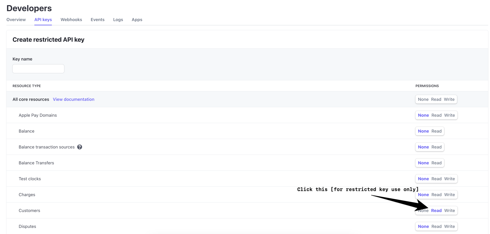
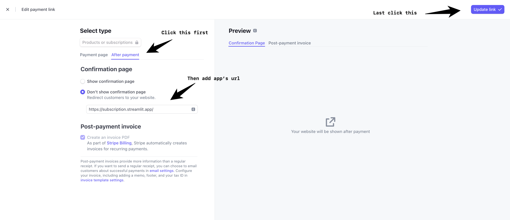

[](https://pypi.org/project/st-paywall/)

[](https://subscription.streamlit.app)

Author: [@tylerjrichards](https://twitter.com/tylerjrichards)

Kind consultant: [@blackary](https://github.com/blackary)

## Installation

```sh
pip install st-paywall
```

## See it in action

Basic example: https://subscription.streamlit.app

<p>&nbsp;</p>

# 🥟 st-paywall

<strong>A python package for creating paid Streamlit apps with a paywall! </strong>

## Overview

This package gives you one basic functions (`add_auth`) that adds subscription functionality to your Streamlit apps. `add_auth` will add both a Google login button if they are not logged in, and a Stripe subscription button to your sidebar if they are not subscribed. If they are subscribed, `st.session_state.user_subscribed` will be true, and if they are logged in, `st.session_state.email` will have their email.
If the `required` parameter is `True`, the app will stop with `st.stop()` if the user is not logged in and subscribed. Otherwise, you the developer will have control over exactly how you want to paywall the apps!

 I hope you use this to create tons of value, and capture some of it with the magic of Streamlit.

This package expects that you have a `.streamlit/secrets.toml` file which you will have to create. Inside it, you will need to add your Stripe and Google API information that runs the authentication and subscription parts of the package.

### Stripe

In order to set up your Stripe (the best and easiest payment infrastructure in the world), go to [Stripe.com](https://stripe.com) and make an account. Once you make an account, you need to make a [payment subscription link](https://dashboard.stripe.com/test/payment-links/create) (which is in test mode by default) and add the link to your app (currently held in streamlit_app.py). If the user to your app logs in and has not already signed up and paid via Stripe, they will be asked to subscribe before they can see the rest of the app.

The subscription link should be added to secrets.toml like this.

```toml
stripe_link = 'https://buy.stripe.com/test_...'`
```

You also need to create an [Standard API key](https://dashboard.stripe.com/test/apikeys), which just like subscription links have test options as well. Store your API key in your secrets file as stripe_api_key and you're off to the races. If you make a restricted API key instead of a Standard key, make sure to add read permission on Customers





The API key should be added to `secrets.toml` like this


```toml
stripe_api_key = 'sk_...'`
```

By default this repo links to creating test subscription links and test api keys (you probably already noticed the 'test' in the Stripe dashboard, the subscription link, and in our example api key). When you launch your app and want folks to pay real money, you will need to create production links and api keys from your [Stripe dashboard](https://dashboard.stripe.com) and use those instead. While you are testing out the Stripe part of your code, you can use [Stripe's test cards](https://stripe.com/docs/testing) instead of inputting your own credit card info! To run st-paywall in test mode, add the following to your secrets file.

```toml
testing_mode = true
```

Then, the package will look for the following secrets. Otherwise, it will look for the production api and link secrets. I highly encourage you to start out in test mode!

```toml
stripe_api_key_test = 'sk_test_...'`
stripe_link_test = 'https://buy.stripe.com/test_...'`
```

Once you decide to leave test mode and publish your subscription app, it is a good idea to have Stripe send the user back to your app once they've subscribed. To do this, go to the [payment links](https://dashboard.stripe.com/payment-links) page, edit your payment link, click 'After payment' and fill out your app's url.




<p>&nbsp;</p>

### Google

In order to set up your Google Oauth, you need to register your web app with Google's OAuth system! So head over to [this url](https://console.cloud.google.com/apis/credentials/oauthclient) and create a web application (and a project, if this is your first go around with Google Cloud). Give a unique name, and add 'http://localhost:8501/' as an "Authorized redirect URI" (when you deploy your app, you'll also need to add the final url of your app to this list). Now press create, and store your client id, and client secret in the secrets.toml file as client_id and client_secret.

For example:

```toml
client_id = '1234.....googleusercontent.com'
client_secret = 'GOC...'
redirect_url = 'http://localhost:8501'
```

The last step for your Google Oauth provisioning is to head over to the [consent screen](https://console.cloud.google.com/apis/credentials/consent) and edit what users will see when logging in. Fill out all the info they ask for, and make sure to add the email scope (called '.../auth/userinfo.email' by Google with the user description 'See your primary Google Account email address'). That should be it! If you are in testing mode, st-paywall will look for the following secrets.

```toml
client_id = '1234.....googleusercontent.com'
client_secret = 'GOC...'
redirect_url_test = 'http://localhost.com:8501'
```

For my test application at subscription.streamlit.app, my Google console looks like this.


### Feedback:

If you have feedback about this package, please reach out to me on [twitter](https://twitter.com/tylerjrichards) or file an issue in [this repo](https://github.com/tylerjrichards/st-paywall/issues) and I will do my best to help you out.