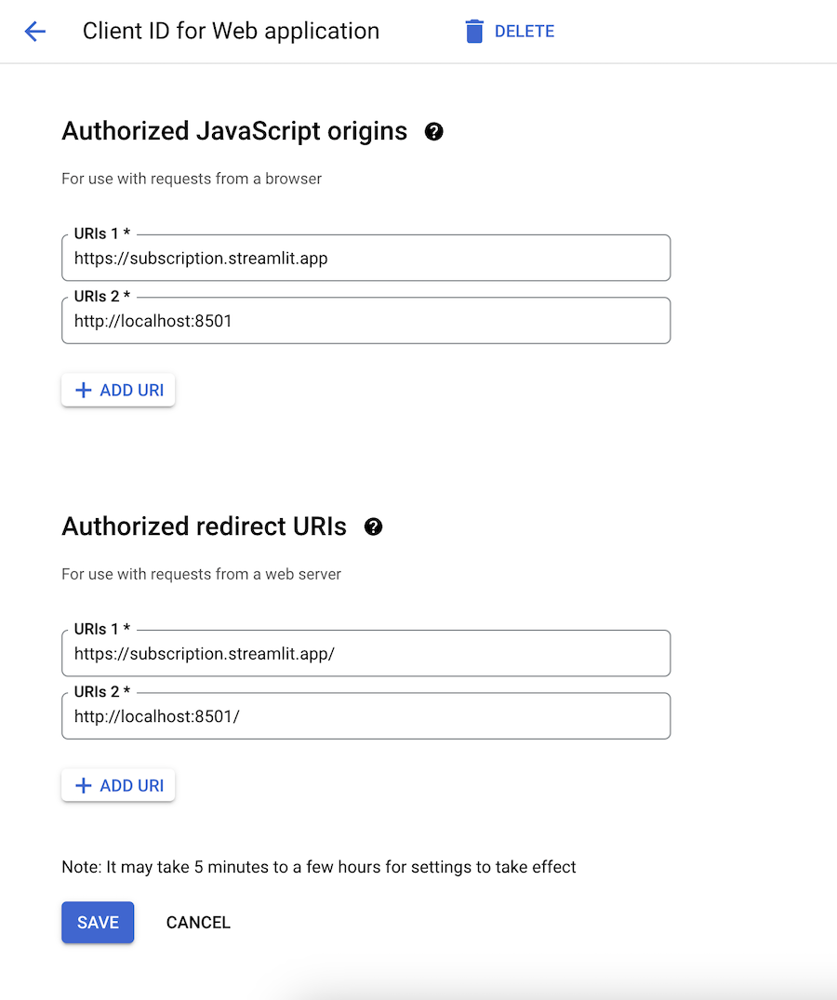

# Authentication with Google

In order to set up your Google Oauth, you need to register your web app with Google's OAuth system! So head over to [this url](https://console.cloud.google.com/apis/credentials/oauthclient) and create a web application (and a project, if this is your first go around with Google Cloud). Give a unique name, and add 'http://localhost:8501/' as an "Authorized redirect URI" (when you deploy your app, you'll also need to add the final url of your app to this list). Now press create, and store your client id, and client secret in the secrets.toml file as client_id and client_secret.

For example:

```toml
client_id = '1234.....googleusercontent.com'
client_secret = 'GOC...'
redirect_url = 'http://localhost:8501'
```

The last step for your Google Oauth provisioning is to head over to the [consent screen](https://console.cloud.google.com/apis/credentials/consent) and edit what users will see when logging in. Fill out all the info they ask for, and make sure to add the email scope (called '.../auth/userinfo.email' by Google with the user description 'See your primary Google Account email address'). That should be it! If you are in testing mode, st-paywall will look for the following secrets.

```toml
client_id = '1234.....googleusercontent.com'
client_secret = 'GOC...'
redirect_url_test = 'http://localhost.com:8501'
```

For my test application at subscription.streamlit.app, my Google console looks like this.

